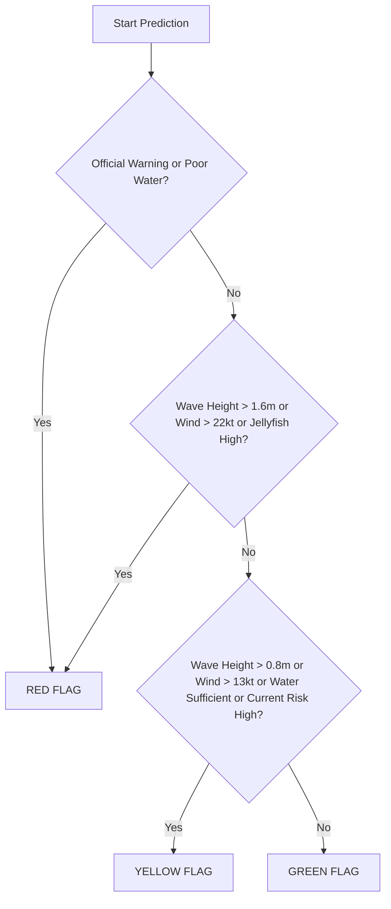

# CheckPraia - System Architecture & Data Sources

This document describes the high-level software architecture, business logic domain structures, external data integrations, and deployment infrastructure.

---

## 0. Deployment Architecture (Raspberry Pi 3)

```
Internet
    │
    ▼
Home Router (port 80, 443 forwarded)
    │
    ▼
Raspberry Pi 3 (1GB RAM, ARMv7)
    │
    ├── UFW Firewall (22, 80, 443 only)
    ├── Fail2Ban (SSH + Nginx brute-force + rate-limit)
    │
    ├── Nginx (SSL termination, gzip, rate limiting)
    │   ├── /etc/nginx/sites-available/checkpraia
    │   └── /etc/nginx/snippets/rate-limit.conf
    │
    ├── PHP 8.4-FPM (OPcache 128MB + JIT 48MB)
    │   └── unix:/var/run/php/php8.4-fpm.sock
    │
    ├── Supervisor (queue worker × 1, 256MB memory limit)
    │   └── artisan queue:work --sleep=3 --tries=3 --max-time=3600
    │
    ├── Cron
    │   ├── * * * * *  artisan schedule:run
    │   ├── */5 * * * * scripts/deploy.sh (auto-pull)
    │   └── 0 3 * * *  certbot renew
    │
    ├── SQLite (WAL mode, no server needed)
    │   └── /home/pi/checkpraia/database/database.sqlite
    │
    ├── Certbot (Let's Encrypt, auto-renewal)
    │   └── /etc/letsencrypt/live/checkpraia.pt/
    │
    └── Bare Git Repo (post-receive hook)
        └── /home/pi/checkpraia.git
```

### Memory budget (1GB total)

| Component | Allocation |
|-----------|-----------|
| Kernel + OS | ~150MB |
| OPcache | 128MB |
| JIT buffer | 48MB |
| PHP-FPM workers (×2) | ~160MB |
| Nginx | ~20MB |
| Supervisor worker | ~80MB |
| SQLite + buffers | ~20MB |
| **Remaining for cache** | **~394MB** |

Swap (512MB) provides safety margin during `composer install` / `npm build`.

### Deploy pipeline

```
git push pi main  ──OR──  cron */5 (auto-pull GitHub)
         │
         ▼
    scripts/deploy.sh
         │
         ├─ flock lock (prevent concurrent deploys)
         ├─ Compare SHAs (skip if no changes)
         ├─ composer install --no-dev --optimize-autoloader
         ├─ npm build (only if resources/ changed)
         ├─ artisan migrate --force
         ├─ artisan config:cache / route:cache / view:cache / event:cache
         ├─ chmod storage/ bootstrap/cache/
         ├─ systemctl reload php8.4-fpm
         ├─ kill -USR2 php-fpm PID (OPcache invalidation)
         └─ supervisorctl restart worker
```

---

## 1. Directory Structure & Architecture

CheckPraia is built on Laravel 13 + Livewire 4, adopting a clean DDD-inspired (Domain-Driven Design) separation of core business logic from framework concerns:

```
checkpraia/
├── app/
│   ├── Domain/                   <-- Core Business Logic Engines
│   │   ├── Community/
│   │   │   └── ConsensusResolver.php <-- Flag Consensus & Votes Audits
│   │   ├── Forecasting/
│   │   │   └── PredictionEngine.php  <-- Weather Flag Decision Checklist
│   │   └── Gamification/
│   │   │   └── ScoreManager.php      <-- Gamification Points & Leaderboards
│   │   
│   ├── Services/                 <-- External API Client Wrappers
│   │   ├── Ipma/IpmaClient.php       <-- Open-Meteo Coordinates Weather
│   │   ├── InfoAgua/InfoAguaClient.php <-- dados.gov.pt APA Water Quality
│   │   ├── Tripadvisor/TripadvisorClient.php <-- OSM TripAdvisor Affiliates
│   │   └── TheFork/TheForkClient.php         <-- OSM TheFork Affiliates
│   │
│   ├── Models/                   <-- Eloquent Database Relationships
│   └── Livewire/                 <-- Livewire 4 Page Components
│
├── database/
│   ├── migrations/               <-- Spatial & Cached Schema Tables
│   └── seeders/BeachSeeder.php   <-- Seeds 76 real Portuguese beaches
│
└── resources/views/livewire/     <-- Glassmorphism PWA Mobile Layouts
```

---

## 2. Dynamic Flag Attribution Logic

CheckPraia resolves the active flag color displayed on the mobile interface through a hierarchical pipeline inside [ConsensusResolver](app/Domain/Community/ConsensusResolver.php):

### Priority 1: Official Restrictions (Maritime Authority / APA)
If a municipal or national authority registers an active warning alert (`OfficialAlert`) of type `interdiction` or `restriction` covering the beach, the flag turns **Red** immediately.
* **Reason displayed:** *"Interdição oficial da autoridade: [Descrição]"*

### Priority 2: Community Consensus Override
If 2 or more distinct users submit a GPS-validated flag report within the last 60 minutes, their votes override the automated forecast.
* **Tie Breaker:** If votes split equally (e.g. 1 Green, 1 Yellow), the algorithm falls back to the **most conservative color** (Red > Yellow > Green) or the latest vote submitted.
* **Reason displayed:** *"Confirmado por utilizadores locais ([X] votos na última hora)."*

### Priority 3: Automated Forecast Decision Tree (Prediction Engine)
If there is no active community consensus, the flag falls back to [PredictionEngine](app/Domain/Forecasting/PredictionEngine.php). Instead of fuzzy metrics, it uses a strict decision checklist similar to those used by certified Portuguese lifeguards (*nadadores-salvadores*):



---

## 3. Real-Time Data Sources & APIs

The platform integrates real, coordinate-based APIs. No values are simulated or hardcoded:

### A. Meteorology & Swell Waves (Open-Meteo)
* **Metadata**: Weather and Marine forecast models calculated precisely for the exact latitude and longitude coordinates of each beach.
* **Weather API Endpoint**: `https://api.open-meteo.com/v1/forecast?latitude={lat}&longitude={lon}&current=temperature_2m,precipitation,wind_speed_10m,wind_direction_10m,uv_index`
* **Marine API Endpoint**: `https://marine-api.open-meteo.com/v1/marine?latitude={lat}&longitude={lon}&current=wave_height,wave_period,wave_direction`
* **UV & Jellyfish Hazard Index**: UV categories (Low, Moderate, High, Very High) are mapped. Jellyfish sightings risks are dynamically computed from strong onshore wind thresholds.

### B. Water Quality Classifications (dados.gov.pt / APA)
* **Metadata**: Fetches official active bathing water classification datasets published by the Agência Portuguesa do Ambiente (APA).
* **API Endpoint**: `https://dados.gov.pt/api/1/datasets/`
* **Properties**: Classifies beach water parameters into Excellent, Good, Sufficient, or Poor classes.

### C. Dining Affiliate Integrations (OpenStreetMap Overpass)
* **Metadata**: Locates dining spots, cafes, and bars within a 2 km radius of the beach coordinates.
* **API Endpoint**: `https://overpass-api.de/api/interpreter`
* **Fallback Link Format**: Links TripAdvisor and TheFork search queries using names and addresses to generate working affiliate redirects:
  - **TripAdvisor Search**: `https://www.tripadvisor.pt/Search?q={restaurant_name}+{address}`
  - **TheFork Search**: `https://www.thefork.pt/search?text={restaurant_name}+{address}`

---

## 4. Gamification & Referral Rules

CheckPraia awards points to motivate user contribution while penalizing false reports:
* **Accepted Report**: `+1 point` awarded to the reporter once the 60-minute evaluation window closes.
* **First Report of the Day**: `+1 point` bonus.
* **User Trust Level**: Users with 50+ accepted reports and a `>=90%` approval rate gain trusted status (their votes count with a weight of `2` during consensus calculations).
* **Consensus Penalty**: If a report contradicts a finished consensus group (e.g. reporting Green when a 75%+ group resolves Red), the user loses `-2 points` to prevent spam or bad-faith reports.
* **Referral milestone**: Referrers earn `+10 points` for every 5 invited users who reach qualified status (submitting at least 1 confirmed beach report).
